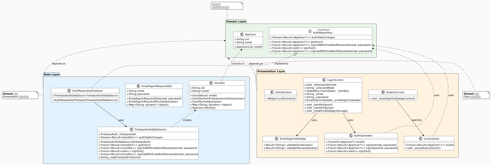

# PopCal

作成中...

## Architecture Overview



### Clean Architectureに準拠
`data` => `domain` <= `presentation`
- `data`は、`domain`のみに依存、`presentation`に依存しない
- `presentation`は、`domain`のみに依存、`data`に依存しない
- `domain`は、どこにも依存しない中核

※[class_diagram.puml](class_diagram.puml) よりPlantUML図をvscode拡張機能でsvg出力

## Project Structure

- `Layer-First` ではなく、`Feature-First` アプローチ
- 上位ディレクトリは、domainやpresentation単位で区切らず、authやhomeなど機能ごとにディレクトリを区切る

## File Naming Conventions

- domainディレクトリ配下のファイルはxxxのみ
- data、domainディレクトリを含むその他の配下のファイルはxxx_dto、xxx_view_modelと命名

## Architecture Decisions

- use case
    - 複数のrepositoryの利用、複雑な処理がないため実装しない
- mapper
    - user_dtoがfirebaseに依存しているが、uidとemailのみでシンプルなため実装しない

## Error Handling

- fpdartライブラリ (Resultクラス) を利用
- エラーはスローせず、`Result<T>.success` または `Result<Failure>.failure` を returnする

## Memo

### Launch Emulator

```bash
cd C:\Users\metalmental\AppData\Local\Android\Sdk\emulator
.\emulator -list-avds
.\emulator -avd Pixel_7a -dns-server 8.8.8.8
```

### Riverpod Generator / Freezed

```bash
dart run custom_lint
dart run build_runner watch -d
```

- Repository
    - firebase instanceをref.read()するため、テスト時はモックして置き換える
    - 引数でref.read()してinjectionしておけば、Providerのコードのみ変更すればよい
- ViewModel/Screen
    - `Interface` のRepositoryをref.read()しているため、モックはしない。コード内で直接ref.read()して使用してよい
    - 逆にコード内でref.read()してよいのは、Interfaceで定義されている@riverpodのみ

### Formatter/Linter

strict modeを使用

```yaml
analyzer:
  language:
    strict-casts: true
    strict-inference: true
    strict-raw-types: true
```

### ライブラリ選定

とりあえずflutter favoriteお墨付きを利用
flutter gemsで検索

https://pub.dev/packages?q=is%3Aflutter-favorite